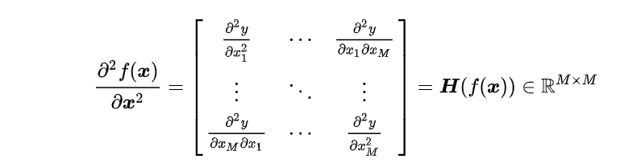
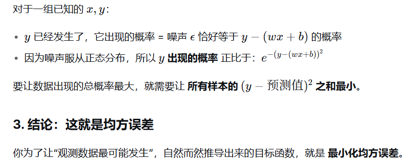
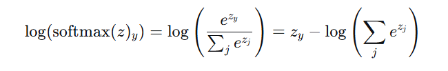
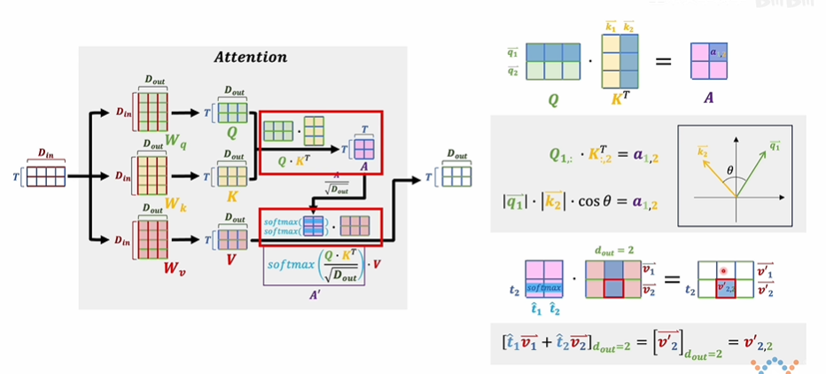
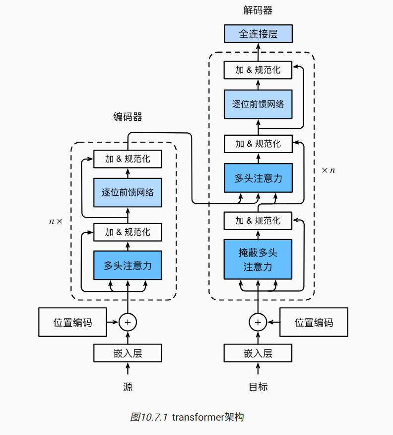

conda activate d2l_env，path下运行jupyter notebook


#### 数据处理


#### 线性代数


#### 矩阵计算

**1. 简介**

在数学中, 矩阵微积分是多元微积分的一种特殊表达，尤其是在矩阵空间上进行讨论的时候。它把单个函数对多个变量或者多元函数对单个变量的偏导数写成向量和矩阵的形式，使其可以被当成一个整体被处理。

2. **偏导数**

矩阵微积分的表示通常有两种符号约定：

- 分子布局（ Numerator Layout）
- 分母布局（ Denominator Layout）

两者的区别是一个标量关于一个向量的导数是写成行向量还是列向量。

【注】向量一般未特殊说明都是用列向量表示。

**2.1 标量关于向量的偏导数**

对于  维向量  和函数 %20%5Cin%20%5Cmathbb%7BR%20%7D)，则  关于  的偏导数为：

- 分母布局：![\frac{\partial y}{\partial \boldsymbol{x } } = [ \frac{\partial y}{\partial x_1 }, \cdots, \frac{\partial y }{\partial x_M } ]^T \in \mathbb{R }^{M \times 1 }](https://math.jianshu.com/math?formula=%5Cfrac%7B%5Cpartial%20y%7D%7B%5Cpartial%20%5Cboldsymbol%7Bx%20%7D%20%7D%20%3D%20%5B%20%5Cfrac%7B%5Cpartial%20y%7D%7B%5Cpartial%20x_1%20%7D%2C%20%5Ccdots%2C%20%5Cfrac%7B%5Cpartial%20y%20%7D%7B%5Cpartial%20x_M%20%7D%20%5D%5ET%20%5Cin%20%5Cmathbb%7BR%20%7D%5E%7BM%20%5Ctimes%201%20%7D)
- 分子布局：![\frac{\partial y}{\partial \boldsymbol{x } } = [ \frac{\partial y}{\partial x_1 }, \cdots, \frac{\partial y}{\partial x_M } ] \in \mathbb{R}^{1 \times M }](https://math.jianshu.com/math?formula=%5Cfrac%7B%5Cpartial%20y%7D%7B%5Cpartial%20%5Cboldsymbol%7Bx%20%7D%20%7D%20%3D%20%5B%20%5Cfrac%7B%5Cpartial%20y%7D%7B%5Cpartial%20x_1%20%7D%2C%20%5Ccdots%2C%20%5Cfrac%7B%5Cpartial%20y%7D%7B%5Cpartial%20x_M%20%7D%20%5D%20%5Cin%20%5Cmathbb%7BR%7D%5E%7B1%20%5Ctimes%20M%20%7D)

在分母布局中， 为列向量；而在分子布局中， 为行向量。

**2.2 向量关于标量的偏导数**

对于标量  和函数 %20%5Cin%20%5Cmathbb%7BR%20%7D%5EN)，则  关于  的偏导数为：

- 分母布局：![\frac{\partial{\boldsymbol{y} } }{\partial x } = [ \frac{\partial y_1 }{\partial x }, \cdots, \frac{\partial y_N }{\partial x } ] \in \mathbb{R }^{1 \times N }](https://math.jianshu.com/math?formula=%5Cfrac%7B%5Cpartial%7B%5Cboldsymbol%7By%7D%20%7D%20%7D%7B%5Cpartial%20x%20%7D%20%3D%20%5B%20%5Cfrac%7B%5Cpartial%20y_1%20%7D%7B%5Cpartial%20x%20%7D%2C%20%5Ccdots%2C%20%5Cfrac%7B%5Cpartial%20y_N%20%7D%7B%5Cpartial%20x%20%7D%20%5D%20%5Cin%20%5Cmathbb%7BR%20%7D%5E%7B1%20%5Ctimes%20N%20%7D)
- 分子布局：![\frac{\partial{\boldsymbol{y } } }{\partial x } = [ \frac{\partial y_1 }{\partial x }, \cdots, \frac{\partial y_N }{\partial x } ]^T \in \mathbb{R }^{N \times 1 }](https://math.jianshu.com/math?formula=%5Cfrac%7B%5Cpartial%7B%5Cboldsymbol%7By%20%7D%20%7D%20%7D%7B%5Cpartial%20x%20%7D%20%3D%20%5B%20%5Cfrac%7B%5Cpartial%20y_1%20%7D%7B%5Cpartial%20x%20%7D%2C%20%5Ccdots%2C%20%5Cfrac%7B%5Cpartial%20y_N%20%7D%7B%5Cpartial%20x%20%7D%20%5D%5ET%20%5Cin%20%5Cmathbb%7BR%20%7D%5E%7BN%20%5Ctimes%201%20%7D)

在分母布局中， 为行向量；而在分子布局中， 为列向量。

**2.3 向量关于向量的偏导数**

> 对于  维向量  和函数 %20%5Cin%20%5Cmathbb%7BR%20%7D%5EN)，则 ) 关于  的偏导数为：

- 分母布局：![\frac{\partial{f(\boldsymbol{x }) } }{\partial \boldsymbol{x } } = \left[ \begin{matrix} \frac{\partial y_1 }{\partial x_1 } & \cdots & \frac{\partial y_N }{\partial x_1 } \\ \vdots & \ddots & \vdots \\ \frac{\partial y_1 }{\partial x_M } & \cdots & \frac{\partial y_N }{\partial x_M } \end{matrix} \right] = \boldsymbol{J }(f(\boldsymbol{x }))^T \in \mathbb{R }^{M \times N }](https://math.jianshu.com/math?formula=%5Cfrac%7B%5Cpartial%7Bf(%5Cboldsymbol%7Bx%20%7D)%20%7D%20%7D%7B%5Cpartial%20%5Cboldsymbol%7Bx%20%7D%20%7D%20%3D%20%5Cleft%5B%20%5Cbegin%7Bmatrix%7D%20%5Cfrac%7B%5Cpartial%20y_1%20%7D%7B%5Cpartial%20x_1%20%7D%20%26%20%5Ccdots%20%26%20%5Cfrac%7B%5Cpartial%20y_N%20%7D%7B%5Cpartial%20x_1%20%7D%20%5C%5C%20%5Cvdots%20%26%20%5Cddots%20%26%20%5Cvdots%20%5C%5C%20%5Cfrac%7B%5Cpartial%20y_1%20%7D%7B%5Cpartial%20x_M%20%7D%20%26%20%5Ccdots%20%26%20%5Cfrac%7B%5Cpartial%20y_N%20%7D%7B%5Cpartial%20x_M%20%7D%20%5Cend%7Bmatrix%7D%20%5Cright%5D%20%3D%20%5Cboldsymbol%7BJ%20%7D(f(%5Cboldsymbol%7Bx%20%7D))%5ET%20%5Cin%20%5Cmathbb%7BR%20%7D%5E%7BM%20%5Ctimes%20N%20%7D)
- 分子布局：![\frac{\partial{f(\boldsymbol{x }) } }{\partial \boldsymbol{x } } = \left[ \begin{matrix} \frac{\partial y_1 }{\partial x_1 } & \cdots & \frac{\partial y_1 }{\partial x_M } \\ \vdots & \ddots & \vdots \\ \frac{\partial y_N }{\partial x_1 } & \cdots & \frac{\partial y_N }{\partial x_M } \end{matrix} \right] = \boldsymbol{J }(f(\boldsymbol{x })) \in \mathbb{R }^{N \times M }](https://math.jianshu.com/math?formula=%5Cfrac%7B%5Cpartial%7Bf(%5Cboldsymbol%7Bx%20%7D)%20%7D%20%7D%7B%5Cpartial%20%5Cboldsymbol%7Bx%20%7D%20%7D%20%3D%20%5Cleft%5B%20%5Cbegin%7Bmatrix%7D%20%5Cfrac%7B%5Cpartial%20y_1%20%7D%7B%5Cpartial%20x_1%20%7D%20%26%20%5Ccdots%20%26%20%5Cfrac%7B%5Cpartial%20y_1%20%7D%7B%5Cpartial%20x_M%20%7D%20%5C%5C%20%5Cvdots%20%26%20%5Cddots%20%26%20%5Cvdots%20%5C%5C%20%5Cfrac%7B%5Cpartial%20y_N%20%7D%7B%5Cpartial%20x_1%20%7D%20%26%20%5Ccdots%20%26%20%5Cfrac%7B%5Cpartial%20y_N%20%7D%7B%5Cpartial%20x_M%20%7D%20%5Cend%7Bmatrix%7D%20%5Cright%5D%20%3D%20%5Cboldsymbol%7BJ%20%7D(f(%5Cboldsymbol%7Bx%20%7D))%20%5Cin%20%5Cmathbb%7BR%20%7D%5E%7BN%20%5Ctimes%20M%20%7D)

> 对于  维向量  和函数 %20%5Cin%20%5Cmathbb%7BR%20%7D)，则 ) 关于  的二阶偏导数为：

- 分母布局 = 分子布局：



【注】 和  分别为 Jacobian 矩阵和 Hessian 矩阵。

**3. 偏导数法则**

以下偏导数法则仅以分母布局为例：

**3.1 加减法则**

若 %20%5Cin%20%5Cmathbb%7BR%20%7D%5EN%2C%20%5Cboldsymbol%7Bz%20%7D%20%3D%20g(%5Cboldsymbol%7Bx%20%7D)%20%5Cin%20%5Cmathbb%7BR%20%7D%5EN)，则%20%7D%7B%5Cpartial%20%5Cboldsymbol%7Bx%20%7D%20%7D%20%3D%20%5Cfrac%7B%5Cpartial%20%5Cboldsymbol%7By%7D%20%7D%7B%5Cpartial%20%5Cboldsymbol%7Bx%7D%20%7D%20%2B%20%5Cfrac%7B%5Cpartial%20%5Cboldsymbol%7Bz%20%7D%20%7D%7B%5Cpartial%20%5Cboldsymbol%7Bx%20%7D%20%7D%20%5Cin%20%5Cmathbb%7BR%20%7D%5E%7BM%20%5Ctimes%20N%20%7D)

**3.2 乘法法则**

- 若 %20%5Cin%20%5Cmathbb%7BR%20%7D%5EN%2C%20%5Cboldsymbol%7Bz%20%7D%20%3D%20g(%5Cboldsymbol%7Bx%20%7D)%20%5Cin%20%5Cmathbb%7BR%20%7D%5EN)，则
- 若 %20%5Cin%20%5Cmathbb%7BR%20%7D%5ES%2C%20%5Cboldsymbol%7Bz%20%7D%20%3D%20g(%5Cboldsymbol%7Bx%20%7D)%20%5Cin%20%5Cmathbb%7BR%20%7D%5ET%2C%20A%20%5Cin%20%5Cmathbb%7BR%20%7D%5E%7BS%20%5Ctimes%20T%20%7D) 和  无关，则
- 若 %20%5Cin%20%5Cmathbb%7BR%20%7D%2C%20%5Cboldsymbol%7Bz%20%7D%20%3D%20g(%5Cboldsymbol%7Bx%20%7D)%20%5Cin%20%5Cmathbb%7BR%20%7D%5EN)，则

**3.3 链式法则**

- 若 %20%5Cin%20%5Cmathbb%7BR%20%7D%5EM%2C%20%5Cboldsymbol%7Bz%20%7D%20%3D%20f(%5Cboldsymbol%7By%20%7D)%20%5Cin%20%5Cmathbb%7BR%20%7D%5EN)，则
- 若 %20%5Cin%20%5Cmathbb%7BR%20%7D%5EK%2C%20%5Cboldsymbol%7Bz%20%7D%20%3D%20f(%5Cboldsymbol%7By%20%7D)%20%5Cin%20%5Cmathbb%7BR%20%7D%5EN)，则
- 若  为矩阵，%20%5Cin%20%5Cmathbb%7BR%20%7D%5EK%2C%20z%20%3D%20f(%5Cboldsymbol%7By%20%7D))，则

4. **附录**

**4.1 记忆小技巧：**

- 可以把「标量对向量」和「向量对标量」求导中的**标量看作是一维的行向量**，而**向量则为一般理解的列向量**，则分母/分子布局就表示求导后的向量的布局是跟求导式的分母还是分子保持一致。

> 1. 「标量对向量」求导：分母布局结果为列向量，分子布局结果为行向量。
> 2. 「向量对标量」求导：分母布局结果为行向量，分子布局结果为列向量。

- 对于「向量对向量」求导：既可以看作是分子向量中的每个标量元素对分母向量求导，也可以看作是分母向量对分子向量中的每个标量元素求导，然后便可以使用上一条记忆方法。最终将每个求导的结果向量拼接成一个矩阵，即得到最终的分母/分子布局结果。


#### 自动求导


#### 线性回归与基础优化算法

- 梯度下降通过不断沿着反梯度方向更新参数求解
- 小批量随机梯度下降是深度学习默认的求解算法
- 两个重要的超参数是批量大小和学习率


**梯度下降**

通过不断地在损失函数递减的方向上更新参数来降低误差

梯度下降最简单的用法是计算损失函数（数据集中所有样本的损失均值） 关于模型参数的导数（在这里也可以称为梯度）。 但实际中的执行可能会非常慢：因为在每一次更新参数之前，我们必须遍历整个数据集。 因此，我们通常会在每次需要计算更新的时候随机抽取一小批样本， 这种变体叫做*小批量随机梯度下降*（minibatch stochastic gradient descent）。

在每次迭代中，我们首先随机抽样一个小批量， 它是由固定数量的训练样本组成的。 然后，我们计算小批量的平均损失关于模型参数的导数（也可以称为梯度）。 最后，我们将梯度乘以一个预先确定的正数，并从当前参数的值中减掉。

**超参数**可以调整但不在训练过程中更新的参数


为什么：均方误差损失函数（简称均方损失）可以用于线性回归的一个原因是： 我们假设了观测中包含噪声，其中噪声服从正态分布。

噪声 ϵ*ϵ* 服从正态分布 y已经发生了，它出现的概率 = 噪声 ϵ*ϵ* 恰好等于 y−(wx+b)的概率



##### zero

```python
import random
import torch
from d2l import torch as d2l

# 1. 生成数据集
def synthetic_data(w, b, num_examples):
    """生成y = Xw + b + 噪声的数据集"""
    # X: 从标准正态分布生成形状为(num_examples, len(w))的矩阵
    X = torch.normal(0, 1, (num_examples, len(w)))
    # y: 计算线性变换 Xw + b
    y = torch.matmul(X, w) + b
    # 添加噪声：从均值为0，标准差为0.01的正态分布,y.shape = (1000,)
    y += torch.normal(0, 0.01, y.shape)
    return X, y.reshape((-1, 1))  # 将y转换为列向量

# 真实参数
true_w = torch.tensor([2, -3.4])
true_b = 4.2
# 生成1000个样本
#features: 1000×2矩阵（1000个样本，每个样本2个特征）
#labels: 1000×1矩阵（1000个样本，每个样本1个标签）
features, labels = synthetic_data(true_w, true_b, 1000)

# 2. 读取数据集（小批量）
def data_iter(batch_size, features, labels):
    """生成小批量数据"""
    num_examples = len(features)  # 样本总数
    indices = list(range(num_examples))  # 创建索引列表[0, 1, ..., 999]
    random.shuffle(indices)  #  原地打乱列表元素的顺序
    
#range(num_examples): 创建从0到num_examples-1的整数序列
#list(...): 将range对象转换为列表
#结果：[0, 1, 2, ..., 999]（共1000个索引）

    # 每次迭代返回一个批量,range(start, stop, step)
    for i in range(0, num_examples, batch_size):
        # 获取当前批量的索引
        batch_indices = torch.tensor(
            indices[i: min(i + batch_size, num_examples)])
        # 使用索引获取对应的特征和标签
        yield features[batch_indices], labels[batch_indices]
#使用生成器(yield)节省内存？
#当一个函数包含 yield 语句时，它就不再是一个普通函数，而变成了一个生成器函数。        
        
# 3. 初始化模型参数
# w: 从均值为0，标准差为0.01的正态分布初始化
w = torch.normal(0, 0.01, size=(2, 1), requires_grad=True)
# b: 初始化为0
b = torch.zeros(1, requires_grad=True)

# 4. 定义模型
def linreg(X, w, b):
    """线性回归模型：y = Xw + b"""
    return torch.matmul(X, w) + b  # 矩阵乘法 + 广播加法，广播机制自动将标量b加到每个样本上

# 5. 定义损失函数
def squared_loss(y_hat, y):
    """均方损失函数：0.5 * (y_hat - y)^2"""
    # 确保y的形状与y_hat一致，然后计算平方损失
    return (y_hat - y.reshape(y_hat.shape)) ** 2 / 2

# 6. 定义优化算法
def sgd(params, lr, batch_size):
    """小批量随机梯度下降"""
    with torch.no_grad():  # 禁用梯度计算，在这个块中不追踪梯度
        for param in params:
            # 参数更新：param = param - lr * grad / batch_size
            param -= lr * param.grad / batch_size#不被记录到计算图
            # 梯度清零，避免累积
            param.grad.zero_()
#l.sum() 是 Σ(0.5*(y_hat-y)²)，没有除以 batch_size，因此梯度是 Σ(梯度项)，不是平均梯度，更新时需要手动除以 batch_size 来得到平均梯度
            
# 7. 训练过程
# 设置超参数
batch_size = 10
lr = 0.03  # 学习率
num_epochs = 3  # 训练轮数

for epoch in range(num_epochs):
    # 遍历整个数据集的小批量
    for X, y in data_iter(batch_size, features, labels):
        # 前向传播：计算预测值
        y_hat = linreg(X, w, b)
        # 计算损失
        l = squared_loss(y_hat, y)
        # 反向传播：计算梯度
        # l.sum()将批量的损失求和得到一个标量，然后反向传播
        l.sum().backward()
        # 更新参数
        sgd([w, b], lr, batch_size)
  
#为什么需要 .sum()？l 是形状为 (10, 1) 的张量，包含10个样本的损失
#PyTorch的 backward() 方法需要一个标量（单个数值）才能计算梯度
#.sum() 将10个损失相加得到一个标量


    # 每个epoch后计算整个数据集的损失
    with torch.no_grad():
        train_l = squared_loss(linreg(features, w, b), labels)
        print(f'epoch {epoch + 1}, loss {float(train_l.mean()):f}')

# 8. 评估结果
print(f'真实w: {true_w}')
print(f'估计w: {w.reshape(true_w.shape)}')
print(f'w的估计误差: {true_w - w.reshape(true_w.shape)}')
print(f'真实b: {true_b}')
print(f'估计b: {b}')
print(f'b的估计误差: {true_b - b}')
```

##### torch.matmul

执行两个张量的**矩阵乘法**（matrix multiplication），遵循线性代数中的矩阵乘法规则。

| 特性         | 说明                          |
| :----------- | :---------------------------- |
| **维度支持** | 支持 1D、2D 及高维张量（>2D） |
| **广播机制** | 高维张量的批次维度会自动广播  |
| **行为差异** | 根据输入维度自动选择计算方式  |


##### 广播

广播是 PyTorch/NumPy 的**自动维度扩展机制**，让不同形状的张量能进行运算

| 规则        | 说明                               |
| :---------- | :--------------------------------- |
| 1. 维度对齐 | 从**最后维度**开始比较             |
| 2. 兼容条件 | 维度相等，或其中一个为1，或不存在  |
| 3. 扩展方式 | 缺失维度补1，大小为1的维度复制扩展 |

```python
# 例1: 标量广播
a = torch.randn(3, 4)
b = 5
result = a + b   # b 被广播为 (3, 4)，每个元素加5

# 例2: 向量广播
a = torch.randn(3, 4)   # (3, 4)
b = torch.randn(4)      # (4,) → 视为 (1, 4) → 广播为 (3, 4)
result = a + b          # 每行都加上相同的b

# 例3: 矩阵广播（matmul场景）
a = torch.randn(5, 1, 3, 4)   # 形状A: (5, 1, 3, 4)
b = torch.randn(1, 10, 4, 5)  # 形状B: (1, 10, 4, 5)
#              ↑  ↑
#           维度对齐，从右往左看：
#           - 最后两维 (3,4) 和 (4,5) 做矩阵乘法 → (3,5)
#           - 前面维度 (5,1) 和 (1,10) 广播 → (5, 10)

result = torch.matmul(a, b)   # 形状: (5, 10, 3, 5)


# ✅ 可以广播（维度兼容）
a = torch.randn(5, 3, 4)
b = torch.randn(5, 4, 6)
torch.matmul(a, b)  # 形状: (5, 3, 6)

# ✅ 可以广播（通过广播扩展）
a = torch.randn(5, 1, 3, 4)   # 第2维为1
b = torch.randn(1, 10, 4, 6)  # 第1维为1
torch.matmul(a, b)  # 形状: (5, 10, 3, 6)

# ❌ 无法广播（不兼容）
a = torch.randn(5, 3, 4)
b = torch.randn(6, 4, 6)  # 第1维: 5 vs 6，不相等且都不是1
torch.matmul(a, b)  # RuntimeError!
```


**记忆口诀**：矩阵乘法看最后两维，前面维度能播就播（相等或含1）。


##### yield

`yield` 是 Python 中的一个关键字，用于创建**生成器函数**。当一个函数包含 `yield` 语句时，它就不再是一个普通函数，而变成了一个生成器函数。

```python
def get_numbers_list(n):
    result = []
    for i in range(n):
        result.append(i * 2)
    return result  # 一次性返回整个列表

numbers = get_numbers_list(1000000)  # 立即创建包含100万个元素的列表
# 占用大量内存：100万个整数 × 28字节 ≈ 28MB

def get_numbers_generator(n):
    for i in range(n):
        yield i * 2  # 每次生成一个值，然后暂停

numbers_gen = get_numbers_generator(1000000)  # 不立即创建元素
# 几乎不占用内存，只在需要时生成下一个元素
```


##### concise

```python
import numpy as np
import torch
from torch.utils import data
from d2l import torch as d2l

# 1. 生成数据集
true_w = torch.tensor([2, -3.4])
true_b = 4.2
features, labels = d2l.synthetic_data(true_w, true_b, 1000)

# 2. 读取数据集（使用PyTorch内置API）
def load_array(data_arrays, batch_size, is_train=True):
    """构造一个PyTorch数据迭代器"""
    dataset = data.TensorDataset(*data_arrays)  # 将特征和标签包装成数据集*data_arrays 中的 * 号：把 (features, labels) 这个元组拆开，相当于写成 TensorDataset(features, labels)
    return data.DataLoader(dataset, batch_size, shuffle=is_train)  # 创建数据加载器
#data.TensorDataset：
#将特征和标签打包成一个数据集对象相当于创建一个(features[i], labels[i])的配对列表替代了之前手动实现的索引逻辑


batch_size = 10
data_iter = load_array((features, labels), batch_size)

# 3. 定义模型（使用PyTorch的nn模块）
from torch import nn

net = nn.Sequential(nn.Linear(2, 1))  # 创建一个单层线性模型
#nn.Linear(2, 1)：
#创建一个全连接层（线性层）输入特征数：2（对应features的列数）输出特征数：1（对应labels的列数）
#自动创建权重w和偏置b,参数自动实现前向传播：y = X @ w^T + b

#nn.Sequential：容器，用于按顺序组合多个层,这里虽然只有一个层，但保留Sequential是为了扩展性,输入数据依次通过容器中的每个层

# 4. 初始化模型参数
net[0].weight.data.normal_(0, 0.01)  # 权重从正态分布初始化
net[0].bias.data.fill_(0)  # 偏置初始化为0

# 5. 定义损失函数,公式：MSE = 1/n * Σ(y_pred - y_true)²
loss = nn.MSELoss()  # 均方误差损失

# 6. 定义优化算法
trainer = torch.optim.SGD(net.parameters(), lr=0.03)  # 随机梯度下降优化器

# 7. 训练模型
num_epochs = 3
for epoch in range(num_epochs):
    for X, y in data_iter:
        l = loss(net(X), y)  # 前向传播：计算预测值和损失
        trainer.zero_grad()   # 梯度清零
        l.backward()          # 反向传播：计算梯度
        trainer.step()        # 参数更新
    l = loss(net(features), labels)  # 计算整个数据集的损失
    print(f'epoch {epoch + 1}, loss {l:f}')

# 8. 评估结果
w = net[0].weight.data
print('w的估计误差：', true_w - w.reshape(true_w.shape))
b = net[0].bias.data
print('b的估计误差：', true_b - b)
```

**`net[0]`**：

- 访问`Sequential`容器中的第一个（索引0）层
- 因为只有一个`Linear`层，所以是`net[0]`

**`.weight` 和 `.bias`**：

- `nn.Linear`层自动创建的参数
- `.weight`：形状为`(输出维度, 输入维度)`，这里是`(1, 2)`
- `.bias`：形状为`(输出维度)`，这里是`(1,)`

**`.data`**：

- 访问参数的张量数据（不包含梯度信息）
- 用于直接修改参数值

**初始化方法**：

- `normal_(0, 0.01)`：从均值为0、标准差为0.01的正态分布采样
- `fill_(0)`：用0填充
- 下划线`_`表示原地操作（直接修改原张量）


---


#### softmax回归

**softmax**

一个将模型原始得分转换为归一化概率分布的数学函数。作为神经网络的**标准输出层**，用于多分类任务，提供可解释的预测概率。logic（z）->prob，z越大p越大

**交叉熵**

让模型的**预测概率分布**与**真实标签的概率分布**进行比较。

- 预测概率（猫、狗、汽车三分类）：`[0.85, 0.12, 0.03]`
- One-hot编码是一个向量，**正确类别位置为1，其余所有位置为0**。
- 假设图片的真实类别是“猫”）：`[1, 0, 0]`
- **交叉熵比较的就是这两个向量：`[0.85， 0.12， 0.03]` 和 `[1， 0， 0]`。**


**Softmax回归流程**：

输入 → 线性变换 → Softmax → 概率分布 → 交叉熵损失 → 梯度下降优化

```python
# 1. 前向传播：输入X → 线性变换 → Softmax → 概率分布
y_hat = net(X)                # 形状 (batch_size, 10)

# 2. 计算损失（交叉熵）
l = cross_entropy(y_hat, y)   # 需要概率分布，所以y_hat保持原样

# 3. 计算精度（accuracy内部）
correct_num = accuracy(y_hat, y)   # 这里传入y_hat（概率矩阵）
    # accuracy内部：
    #   - 检测到y_hat是二维且列数>1 → 执行argmax得到预测类别
    #   - 将预测类别与真实标签y逐元素比较 → 布尔张量
    #   - 求和 → 正确个数
```


##### zero

```python
import torch
from IPython import display
from d2l import torch as d2l
import matplotlib.pyplot as plt
import warnings

# 忽略字体警告
warnings.filterwarnings('ignore')

# 1. 数据准备
batch_size = 256
train_iter, test_iter = d2l.load_data_fashion_mnist(batch_size)

# 2. 初始化模型参数
num_inputs = 784  # 28x28=784像素
num_outputs = 10   # 10个类别（10种服装）

# 初始化权重和偏置
W = torch.normal(0, 0.01, size=(num_inputs, num_outputs), requires_grad=True)
b = torch.zeros(num_outputs, requires_grad=True)

# 3. 定义Softmax函数（数值稳定版本）
def softmax(X):
    """Softmax函数实现（数值稳定版本）"""
    # 减去最大值，防止数值溢出
    X_max = X.max(dim=1, keepdim=True).values
    X_exp = torch.exp(X - X_max)  # 减去最大值后再取指数
    partition = X_exp.sum(dim=1, keepdim=True)  # 对每一行求和
    return X_exp / partition  # 归一化

# 4. 定义模型
def net(X):
    """Softmax回归模型"""
    # 将输入展平为(batch_size, num_inputs)，然后进行线性变换
    return softmax(torch.matmul(X.reshape((-1, W.shape[0])), W) + b)

# 5. 定义损失函数（交叉熵）
def cross_entropy(y_hat, y):
    """交叉熵损失函数"""
    # y_hat[range(len(y_hat)), y]：选取每个样本对应真实标签的预测概率
    return -torch.log(y_hat[range(len(y_hat)), y])

# 6. 定义精度计算函数
def accuracy(y_hat, y):
    """计算预测正确的数量"""
    if len(y_hat.shape) > 1 and y_hat.shape[1] > 1:
        y_hat = y_hat.argmax(axis=1)  # 获取预测类别（概率最大的索引）
        #沿第1维（类别维）取最大值所在的索引。
        
    cmp = y_hat.type(y.dtype) == y  # 比较预测和真实标签
    return float(cmp.type(y.dtype).sum())  # 统计正确的数量,将布尔张量转换为与 y 相同的数据类型。

# 7. 定义累加器类（用于统计）
class Accumulator:
    """在n个变量上累加"""
    def __init__(self, n):
        self.data = [0.0] * n
    
    def add(self, *args):
        self.data = [a + float(b) for a, b in zip(self.data, args)]
    
    def reset(self):
        self.data = [0.0] * len(self.data)
    
    def __getitem__(self, idx):
        return self.data[idx]

# 8. 定义评估精度函数
def evaluate_accuracy(net, data_iter):
    """计算在指定数据集上模型的精度"""
    if isinstance(net, torch.nn.Module):
        net.eval()  # 将模型设置为评估模式（如果使用PyTorch Module）
    
    metric = Accumulator(2)  # [正确预测数, 总样本数]
    
    with torch.no_grad():  # 不计算梯度，节省内存
        for X, y in data_iter:
            metric.add(accuracy(net(X), y), y.numel())
    
    return metric[0] / metric[1]  # 准确率 = 正确数 / 总数

# 9. 定义训练一个epoch的函数
def train_epoch_ch3(net, train_iter, loss, updater):
    """训练模型一个迭代周期"""
    if isinstance(net, torch.nn.Module):
        net.train()  # 将模型设置为训练模式
    
    # 累加器：[损失总和, 正确数, 样本数]
    metric = Accumulator(3)
    
    for X, y in train_iter:
        # 前向传播
        y_hat = net(X)
        l = loss(y_hat, y)
        
        # 反向传播和优化
        if isinstance(updater, torch.optim.Optimizer):
            # 使用PyTorch内置优化器
            updater.zero_grad()
            l.mean().backward()
            updater.step()
        else:
            # 使用自定义优化器（小批量随机梯度下降）
            l.sum().backward()
            updater(X.shape[0])
        
        # 统计
        metric.add(float(l.sum()), accuracy(y_hat, y), y.numel())
    
    # 返回平均损失和训练精度
    return metric[0] / metric[2], metric[1] / metric[2]

# 10. 定义优化器
lr = 0.1

def updater(batch_size):
    """小批量随机梯度下降更新器"""
    return d2l.sgd([W, b], lr, batch_size)

# 11. 训练模型（简化版，不使用Animator类）
def train_model(net, train_iter, test_iter, loss, num_epochs, updater):
    """训练模型并显示结果"""
    print("=" * 50)
    print("开始训练Softmax回归模型")
    print("=" * 50)
    
    # 初始评估
    initial_acc = evaluate_accuracy(net, test_iter)
    print(f"初始测试精度: {initial_acc:.4f} (随机猜测水平)")
    
    train_losses = []
    train_accs = []
    test_accs = []
    
    for epoch in range(num_epochs):
        # 训练一个epoch
        train_loss, train_acc = train_epoch_ch3(net, train_iter, loss, updater)
        test_acc = evaluate_accuracy(net, test_iter)
        
        train_losses.append(train_loss)
        train_accs.append(train_acc)
        test_accs.append(test_acc)
        
        print(f"Epoch {epoch + 1}/{num_epochs}: "
              f"Train Loss = {train_loss:.4f}, "
              f"Train Acc = {train_acc:.4f}, "
              f"Test Acc = {test_acc:.4f}")
    
    print("=" * 50)
    print("训练完成!")
    print(f"最终训练精度: {train_acc:.4f}")
    print(f"最终测试精度: {test_acc:.4f}")
    print("=" * 50)
    
    # 绘制训练曲线（使用英文标签）
    plt.figure(figsize=(12, 4))
    
    plt.subplot(1, 2, 1)
    plt.plot(range(1, num_epochs + 1), train_losses, 'b-', label='Train Loss')
    plt.xlabel('Epoch')
    plt.ylabel('Loss')
    plt.title('Training Loss Curve')
    plt.legend()
    plt.grid(True)
    
    plt.subplot(1, 2, 2)
    plt.plot(range(1, num_epochs + 1), train_accs, 'g-', label='Train Accuracy')
    plt.plot(range(1, num_epochs + 1), test_accs, 'r-', label='Test Accuracy')
    plt.xlabel('Epoch')
    plt.ylabel('Accuracy')
    plt.title('Accuracy Curve')
    plt.legend()
    plt.grid(True)
    
    plt.tight_layout()
    plt.show()
    
    return train_losses, train_accs, test_accs

# 12. 训练模型
num_epochs = 10
train_losses, train_accs, test_accs = train_model(
    net, train_iter, test_iter, cross_entropy, num_epochs, updater
)

# 13. 预测并显示结果（使用英文标签）
def predict_and_display(net, test_iter, n=6):
    """预测并显示前n个样本"""
    # 获取一批数据
    for X, y in test_iter:
        break
    
    # 预测
    y_hat = net(X)
    y_pred = y_hat.argmax(axis=1)
    
    # Fashion-MNIST标签映射（英文）
    fashion_labels = [
        'T-shirt/top', 'Trouser', 'Pullover', 'Dress', 'Coat',
        'Sandal', 'Shirt', 'Sneaker', 'Bag', 'Ankle boot'
    ]
    
    # 计算准确率
    correct = (y_pred == y).sum().item()
    total = y.size(0)
    accuracy_batch = correct / total
    
    print(f"\nBatch accuracy: {accuracy_batch:.4f} ({correct}/{total})")
    print(f"Sample predictions (first {n}):")
    
    # 显示前n个图像
    plt.figure(figsize=(15, 8))
    for i in range(n):
        plt.subplot(2, n//2, i + 1)
        plt.imshow(X[i].reshape(28, 28).numpy(), cmap='gray')
        
        true_label = fashion_labels[y[i].item()]
        pred_label = fashion_labels[y_pred[i].item()]
        
        # 绿色表示正确，红色表示错误
        color = 'green' if y[i] == y_pred[i] else 'red'
        title = f'True: {true_label}\nPred: {pred_label}'
        if y[i] != y_pred[i]:
            title += f'\n✗ Incorrect'
        else:
            title += f'\n✓ Correct'
        
        plt.title(title, color=color)
        plt.axis('off')
    
    plt.suptitle(f'Softmax Regression Predictions (Batch Accuracy: {accuracy_batch:.2%})', 
                 fontsize=16)
    plt.tight_layout()
    plt.show()
    
    # 显示预测概率分布示例
    print(f"\nPrediction probabilities for first sample:")
    print(f"True label: {fashion_labels[y[0].item()]}")
    print(f"Predicted label: {fashion_labels[y_pred[0].item()]}")
    print("\nProbability distribution:")
    for idx, prob in enumerate(y_hat[0]):
        if prob > 0.01:  # 只显示概率大于1%的类别
            print(f"  {fashion_labels[idx]:15s}: {prob:.4f}")
    
    return accuracy_batch

# 14. 进行预测
print("\n" + "="*50)
print("模型预测示例")
print("="*50)
predict_and_display(net, test_iter, n=8)

# 15. 模型分析
print("\n" + "="*50)
print("模型性能分析")
print("="*50)

# 计算最终模型在所有测试数据上的准确率
print("Evaluating model on full test set...")
final_test_acc = evaluate_accuracy(net, test_iter)
print(f"Final model test accuracy: {final_test_acc:.4f}")

# 检查过拟合情况
if train_accs[-1] - test_accs[-1] > 0.1:
    print("Warning: Model shows signs of overfitting!")
else:
    print("Good: Model generalization seems reasonable.")

# 学习曲线分析
if train_losses[-1] < 0.5 and train_losses[-1] > train_losses[0]:
    print("Loss decreased significantly during training.")
elif train_losses[-1] < 0.1:
    print("Excellent: Loss converged to a very low value.")
else:
    print("Training might need more epochs or hyperparameter tuning.")

print("="*50)
```

| 组件         | 代码体现                      |
| :----------- | :---------------------------- |
| 输入特征     | `X.reshape((-1,784))`         |
| 线性得分     | `torch.matmul(X, W) + b`      |
| Softmax转换  | `softmax()` 函数              |
| 预测类别     | `y_hat.argmax(axis=1)`        |
| 交叉熵损失   | `-torch.log(y_hat[range, y])` |
| 梯度下降更新 | `d2l.sgd`                     |

##### *train

```python
def train_epoch_ch3(net, train_iter, loss, updater):  #@save
    """训练模型一个迭代周期（定义见第3章）"""
    # 训练损失总和、训练准确度总和、样本数
    metric = Accumulator(3)
    if isinstance(updater, gluon.Trainer):
        updater = updater.step
    for X, y in train_iter:
        # 计算梯度并更新参数
        with autograd.record():
            y_hat = net(X)
            l = loss(y_hat, y)
        l.backward()
        updater(X.shape[0])
        metric.add(float(l.sum()), accuracy(y_hat, y), y.size)
    # 返回训练损失和训练精度
    return metric[0] / metric[2], metric[1] / metric[2]


class Animator:  #@save
    """在动画中绘制数据"""
    def __init__(self, xlabel=None, ylabel=None, legend=None, xlim=None,
                 ylim=None, xscale='linear', yscale='linear',
                 fmts=('-', 'm--', 'g-.', 'r:'), nrows=1, ncols=1,
                 figsize=(3.5, 2.5)):
        # 增量地绘制多条线
        if legend is None:
            legend = []
        d2l.use_svg_display()
        self.fig, self.axes = d2l.plt.subplots(nrows, ncols, figsize=figsize)
        if nrows * ncols == 1:
            self.axes = [self.axes, ]
        # 使用lambda函数捕获参数
        self.config_axes = lambda: d2l.set_axes(
            self.axes[0], xlabel, ylabel, xlim, ylim, xscale, yscale, legend)
        self.X, self.Y, self.fmts = None, None, fmts

    def add(self, x, y):
        # 向图表中添加多个数据点
        if not hasattr(y, "__len__"):
            y = [y]
        n = len(y)
        if not hasattr(x, "__len__"):
            x = [x] * n
        if not self.X:
            self.X = [[] for _ in range(n)]
        if not self.Y:
            self.Y = [[] for _ in range(n)]
        for i, (a, b) in enumerate(zip(x, y)):
            if a is not None and b is not None:
                self.X[i].append(a)
                self.Y[i].append(b)
        self.axes[0].cla()
        for x, y, fmt in zip(self.X, self.Y, self.fmts):
            self.axes[0].plot(x, y, fmt)
        self.config_axes()
        display.display(self.fig)
        display.clear_output(wait=True)

def train_ch3(net, train_iter, test_iter, loss, num_epochs, updater):  #@save
    """训练模型（定义见第3章）"""
    animator = Animator(xlabel='epoch', xlim=[1, num_epochs], ylim=[0.3, 0.9],
                        legend=['train loss', 'train acc', 'test acc'])
    for epoch in range(num_epochs):
        train_metrics = train_epoch_ch3(net, train_iter, loss, updater)
        test_acc = evaluate_accuracy(net, test_iter)
        animator.add(epoch + 1, train_metrics + (test_acc,))
    train_loss, train_acc = train_metrics
    assert train_loss < 0.5, train_loss
    assert train_acc <= 1 and train_acc > 0.7, train_acc
    assert test_acc <= 1 and test_acc > 0.7, test_acc 
    
    
    
    
    
    
def predict_ch3(net, test_iter, n=6):  #@save
    """预测标签（定义见第3章）"""
    for X, y in test_iter:
        break
    trues = d2l.get_fashion_mnist_labels(y)
    preds = d2l.get_fashion_mnist_labels(net(X).argmax(axis=1))
    titles = [true +'\n' + pred for true, pred in zip(trues, preds)]
    d2l.show_images(
        X[0:n].reshape((n, 28, 28)), 1, n, titles=titles[0:n])

predict_ch3(net, test_iter)
```


##### concise_

```python
import torch
from torch import nn
from d2l import torch as d2l

# 1. 数据准备
batch_size = 256
train_iter, test_iter = d2l.load_data_fashion_mnist(batch_size)

# 2. 模型定义
net = nn.Sequential(
    nn.Flatten(),        # 展平层：将 (batch, 1, 28, 28) → (batch, 784)
    nn.Linear(784, 10)   # 全连接层：输入784，输出10（类别得分）
)

# 3. 权重初始化
def init_weights(m):
    if type(m) == nn.Linear:
        nn.init.normal_(m.weight, std=0.01)  # 权重正态分布初始化
        # 偏置默认初始化为0，无需额外设置

net.apply(init_weights)   # 递归地对net中所有模块应用初始化函数

# 4. 损失函数（内置Softmax + 交叉熵）
loss = nn.CrossEntropyLoss(reduction='none')  # reduction='none'返回每个样本的损失

# 5. 优化算法
trainer = torch.optim.SGD(net.parameters(), lr=0.1)

# 6. 训练
num_epochs = 10
d2l.train_ch3(net, train_iter, test_iter, loss, num_epochs, trainer)
```

**为什么需要 `Flatten`？**

- `nn.Linear` 期望输入是二维张量 `(batch, features)`。
- 原始图像是四维 `(batch, channel, height, width)`，必须**展平**才能送入全连接层。
- `nn.Flatten()` 从第1维开始展平（默认 `start_dim=1`），将 `(batch, 1, 28, 28)` 变为 `(batch, 784)`。

**全连接层 `nn.Linear(784, 10)`**

- 执行线性变换：`output = input @ W.T + b`，其中 `W` 形状 `(10, 784)`，`b` 形状 `(10,)`。
- 输出是**未规范化的类别得分（logits）**，形状 `(batch, 10)`。
- 注意：**这里没有显式添加 Softmax**，因为后面使用的损失函数会内部处理。

- **`net.apply(init_weights)`**：递归地将 `init_weights` 函数应用到 `net` 的所有子模块上。
- 只对 `nn.Linear` 层初始化：权重从均值为0、标准差0.01的正态分布采样，偏置默认初始化为0（PyTorch 默认行为）。
- 这与从零实现中的 `W = torch.normal(0,0.01,(784,10), requires_grad=True)` 完全等价。

**损失函数：`nn.CrossEntropyLoss`**

**将 Softmax + 对数 + 交叉熵合并为一个数值稳定的操作**

- 输入：**未规范化的得分（logits）**，形状 `(batch, num_classes)`。
- 内部操作（数学等价）：
  1. **LogSoftmax**：先计算 `log_softmax(logits)`采用 **LogSumExp 技巧** 避免数值溢出。
  2. **负对数似然（NLLLoss）**：根据真实标签取出对应的 `log_softmax` 值，取负。


#### 感知机


```python
import torch
from torch import nn
from d2l import torch as d2l

# 1. 加载数据
batch_size = 256
train_iter, test_iter = d2l.load_data_fashion_mnist(batch_size)

# 2. 初始化模型参数
num_inputs, num_outputs, num_hiddens = 784, 10, 256

W1 = nn.Parameter(torch.randn(num_inputs, num_hiddens, requires_grad=True) * 0.01)
b1 = nn.Parameter(torch.zeros(num_hiddens, requires_grad=True))
W2 = nn.Parameter(torch.randn(num_hiddens, num_outputs, requires_grad=True) * 0.01)
b2 = nn.Parameter(torch.zeros(num_outputs, requires_grad=True))

params = [W1, b1, W2, b2]

# 3. 定义激活函数
def relu(X):
    a = torch.zeros_like(X)
    return torch.max(X, a)

# 4. 定义模型
def net(X):
    X = X.reshape((-1, num_inputs))
    H = relu(X @ W1 + b1)  # 矩阵乘法
    return H @ W2 + b2

# 5. 定义损失函数
loss = nn.CrossEntropyLoss(reduction='none')

# 6. 训练
num_epochs, lr = 10, 0.1
updater = torch.optim.SGD(params, lr=lr)
d2l.train_ch3(net, train_iter, test_iter, loss, num_epochs, updater)

# 7. 预测
d2l.predict_ch3(net, test_iter)
```


**为什么要加隐藏层？**

使其具备强大的表达能力和拟合复杂函数的能力


**缓解过拟合的正则化技术：**

- 权重衰退，在原来的损失函数（如均方误差）中，加上模型权重 w 的 L2 范数的平方作为惩罚项。
- 暂退法（dropout），对于每一层（通常是隐藏层），以概率 p 将该层的部分神经元输出随机置为0。


**梯度消失与梯度爆炸**

在深层网络中，反向传播时梯度需要连乘很多层。这会导致两种问题：

- **梯度消失**：梯度变得极小（接近0），导致靠前的网络层**几乎停止更新**，模型无法学习。
  - **典型例子**：使用 **Sigmoid** 激活函数。当输入值过大或过小时，其梯度会趋近于0。多层相乘后，梯度迅速消失。
- **梯度爆炸**：梯度变得极大（指数级增长），导致参数更新幅度巨大，模型**不稳定、无法收敛**。
  - **典型例子**：权重初始化值太大，或网络层数过深时，连乘结果会爆炸。


**计算图**

深度学习框架本质上是可微分（可反向传播）的计算图（computation graph）

可微才可学

- - 有向无环图（DAG）： 深度学习的计算图通常是一个有向无环图（Directed Acyclic Graph，DAG）。节点代表操作（operation）或变量（variable），边代表数据流（张量流动）。由于图是无环的，数据沿着计算路径单向流动，确保了数据前向传播的顺序性，并且可以反向传播计算梯度。
  - 自动求导机制（自动微分）： 计算图的一个核心特点是支持自动求导。反向传播通过链式法则对图中的每个操作自动计算梯度，简化了模型训练中的梯度计算。框架会根据计算图结构，自动生成反向传播的路径。
    - chain rule
- 所有的深度学习网络所表示的函数，是一个可微分的函数；
  - 不只是 forward，还包括 model forward + loss 整体都是可微的；
- 注意 torch 中的一些特殊算子
  - 不可微：torch.argmax
  - 看似不可微，其实实现 grad_fn 的：topk


#### 深度学习计算

**层和块**

- init_()
- forward() 定义模型的前向传播，即如何根据输入X返回所需的模型输出

**参数管理**

- net.apply(init_normal)，对 net 里面每一层都调用 init_normal
- shared = nn.Linear(8, 8)，参数共享，也叫参数绑定
  - 同一个参数参与了两次计算，两次计算都对它产生梯度，最终梯度 = 两处梯度加起来
  - 减少参数数量
    降低过拟合风险
    表达“这些地方应该使用同一种规则”
    节省内存
  - 卷积神经网络 CNN：同一个卷积核在整张图上滑动
    循环神经网络 RNN：同一个单元在不同时间步重复使用
    一些语言模型：输入词嵌入和输出词嵌入共享参数
- state_dict() 可以查看模型参数字典。
- named_parameters() 可以遍历所有参数

```python
def init_normal(m):
    if type(m) == nn.Linear:
        nn.init.normal_(m.weight, mean=0, std=0.01)
        nn.init.zeros_(m.bias)

model = MyModel()
model.apply(init_normal)

第一步：MyModel() 调用 __init__
       创建 layer1、layer2
       每个 Linear 自动有 weight、bias

第二步：model.apply(init_normal)
       把已有的 weight、bias 重新设置成你指定的初始值
```

**延后初始化**

有些层一开始不知道参数形状，先不真正创建参数；等第一批数据进来后，再根据数据形状推断参数形状并初始化。

什么样的层？

参数形状依赖输入维度；
如果输入维度暂时未知，可以延后到第一次 forward 时再初始化。

nn.LazyLinear(256)，只是输出是 256，weight 应该是 [256, ?]这个 ? 要等第一次数据进来才知道。

- 第一次输入会“锁定”参数形状
- 不要在延后初始化前乱访问参数值。
- 如果要创建优化器，最好先用一批假数据跑一次。


**自定义层**

```python
class MyLayer(nn.Module):
    def __init__(self):
        super().__init__()
        # 在这里定义需要的东西

    def forward(self, X):
        # 在这里写计算逻辑
        return 输出
    
  
import torch
from torch import nn
from torch.nn import functional as F

class MyLinear(nn.Module):
    def __init__(self, in_units, units):
        super().__init__()
        self.weight = nn.Parameter(torch.randn(in_units, units))
        self.bias = nn.Parameter(torch.randn(units,))

    def forward(self, X):
        linear = torch.matmul(X, self.weight) + self.bias
        return F.relu(linear)
```


**读写文件**

- torch.save(对象, 文件名)
  torch.load(文件名)

- torch.save(net.state_dict(), 'mlp.params')

  clone.load_state_dict(torch.load('mlp.params'))

```python
# 保存
torch.save(net.state_dict(), 'mlp.params')

# 加载
model = MLP()
model.load_state_dict(torch.load('mlp.params'))
model.eval()
```

**GPU**

```python
device = torch.device('cuda' if torch.cuda.is_available() else 'cpu')

model = MyModel()
model = model.to(device)

for X, y in data_iter:
    X = X.to(device)
    y = y.to(device)

    y_hat = model(X)
    loss = loss_fn(y_hat, y)

    optimizer.zero_grad()
    loss.backward()
    optimizer.step()
```

```python
device = torch.device('cuda' if torch.cuda.is_available() else 'cpu')

model = MyModel()
model.load_state_dict(torch.load('model.pth', map_location=device))
model = model.to(device)
model.eval()
```

模型在哪，参数在哪


#### 注意力






- Transformer为何使用多头注意力机制？（为什么不使用一个头）

  一个头只能在一个表示子空间里建模一种注意力模式。多头相当于让模型从不同子空间、不同关系角度同时看序列，比如语法关系、长距离依赖、局部搭配等。
  本质：**多头提升表达能力，不是单纯增加参数。**

- 2.Transformer为什么Q和K使用不同的权重矩阵生成，为何不能使用同一个值进行自身的点乘？ （注意和第一个问题的区别）

  Q 表示“我想找什么”，K 表示“我能被如何匹配”。二者角色不同。
  如果 Q=K，相当于用同一种表示同时负责“提问”和“被检索”，attention score 会受到强约束，例如自注意力 logits XX^T 天然是对称的，表达能力下降。
  本质：**Q/K 分开是为了让匹配关系更灵活，可以建模非对称关系。**

- 3.Transformer计算attention的时候为何选择点乘而不是加法？两者计算复杂度和效果上有什么区别？

  点乘注意力：

  ```
  score = QK^T
  ```

  加法注意力通常是：

  ```
  score = v^T tanh(Wq q + Wk k)
  ```

  两者理论复杂度都和 token 对数量有关，约为 O(n^2 d)，但点乘可以直接用矩阵乘法，高度并行，GPU 上非常快。加法注意力需要对每对 token 过一个小 MLP，常数更大、并行效率差。
  效果上，加法注意力更灵活一些，但 Transformer 选择点乘是因为：**足够有效，且极其高效。**

- 4.为什么在进行softmax之前需要对attention进行scaled（为什么除以dk的平方根），并使用公式推导进行讲解

  Std(q · k) = sqrt(dk)
  当 dk 很大时，点积值方差变大，softmax 输入过大，会变得非常尖锐：

  softmax([大值, 小值, ...])
  结果接近 one-hot，梯度变小，训练不稳定。
  所以使用：

  Attention(Q,K,V) = softmax(QK^T / sqrt(dk)) V
  本质：把 attention logits 的尺度稳定在合理范围，避免 softmax 饱和。

- 5.在计算attention score的时候如何对padding做mask操作？

  在 softmax 之前，把 padding 位置对应的 score 加上一个极小值：

  ```
  score = score.masked_fill(pad_mask, -inf) attn = softmax(score)
  ```

- 6.为什么在进行多头注意力的时候需要对每个head进行降维？（可以参考上面一个问题）

  **多头不是为了暴力扩大计算，而是把表示空间切成多个子空间并行建模**

- 7.大概讲一下Transformer的Encoder模块？

- 8.为何在获取输入词向量之后需要对矩阵乘以embedding size的开方？意义是什么？

   positional encoding 会直接加到 embedding 上。乘这个系数可以放大词向量尺度，避免位置编码在数值上过强或词向量过弱。
  本质：**平衡 token embedding 和 positional encoding 的尺度**

- 9.简单介绍一下Transformer的位置编码？有什么意义和优缺点？

  Self-Attention 本身不感知顺序。没有位置编码，句子只是一个 token 集合。

- 10.你还了解哪些关于位置编码的技术，各自的优缺点是什么？

  **RoPE**：通过旋转编码注入相对位置信息。长文本、大模型常用，外推能力较好。

- 11.简单讲一下Transformer中的残差结构以及意义。

  每个子层外都有残差：

  ```
  x = x + Sublayer(x)
  ```

  意义：缓解梯度消失，让深层模型更容易训练；同时保留原始信息，子层只需学习增量变化。

- 12.为什么transformer块使用LayerNorm而不是BatchNorm？LayerNorm 在Transformer的位置是哪里？

  BatchNorm 依赖 batch 统计量，不适合变长序列、小 batch、自回归生成。
  LayerNorm 对每个 token 的 hidden 维度做归一化，不依赖 batch，更适合 NLP。
  位置有两种：

  ```
  Post-LN: x + Sublayer(x) 后做 LN Pre-LN: Sublayer(LN(x)) 后残差相加
  ```

  现代大模型多用 Pre-LN，训练更稳定。

- 13.简答讲一下BatchNorm技术，以及它的优缺点。

  BatchNorm 对一个 batch 内的特征做归一化：

  ```
  x_hat = (x - mean_batch) / sqrt(var_batch + eps)
  ```

  优点：加速训练，稳定梯度，有一定正则化效果。
  缺点：依赖 batch size；训练和推理行为不同；对变长序列、自回归任务不友好。

- 14.简单描述一下Transformer中的前馈神经网络？使用了什么激活函数？相关优缺点？

  FFN 对每个 token 独立作用：

  ```
  FFN(x) = W2 activation(W1 x + b1) + b2
  ```

  原论文使用 ReLU。现代模型常用 GELU、SwiGLU。
  ReLU 简单高效，但表达能力有限；GELU 更平滑；SwiGLU 效果更强，但参数和计算更多。

- 15.Encoder端和Decoder端是如何进行交互的？（在这里可以问一下关于seq2seq的attention知识）

  Decoder 当前生成位置作为 query，去 Encoder 编码好的源句信息里检索相关内容。

  Q 来自 Decoder
  K, V 来自 Encoder

- 16.Decoder阶段的多头自注意力和encoder的多头自注意力有什么区别？（为什么需要decoder自注意力需要进行 sequence mask)

  Encoder self-attention 可以看完整输入序列。
  Decoder self-attention 只能看当前位置之前的 token，不能看未来 token。
  所以需要 causal mask：

  ```
  位置 t 只能 attend 到 <= t 的位置
  ```

  **防止训练时看到未来答案，造成信息泄露。**

- 17.Transformer的并行化提现在哪个地方？Decoder端可以做并行化吗？

  Encoder 可以并行处理所有 token，因为 self-attention 一次计算整个 QK^T。
  训练时 Decoder 也可以并行，因为目标序列已知，只需加 causal mask。
  推理时 Decoder 不能完全并行，因为必须一个 token 一个 token 自回归生成。
  **训练可并行，推理生成受自回归限制。**

- 19.Transformer训练的时候学习率是如何设定的？Dropout是如何设定的，位置在哪里？Dropout 在测试的需要有什么需要注意的吗？

  原论文学习率使用 warmup + decay：

  ```
  lr = d_model^-0.5 * min(step^-0.5, step * warmup^-1.5)
  ```

  先升高，再衰减。
  Dropout 常放在 attention 权重、FFN、残差连接、embedding/positional encoding 后。原论文常用 0.1。
  测试/推理时 Dropout 必须关闭，否则输出不稳定。

- 20解码端的残差结构有没有把后续未被看见的mask信息添加进来，造成信息的泄露。

  不会。残差加的是当前层输入 x，而这个 x 本身只包含当前位置已有的信息。
  masked self-attention 的输出已经通过 causal mask 限制，无法看到未来 token。


#### pytorch一些小常识

**轴**

在 PyTorch 和 NumPy 中，`axis`（或 `dim`）参数指定**沿哪个轴（维度）进行操作**。对于二维张量（矩阵）：

- **`axis=0`**：垂直方向（行），**跨行操作**，每一列是一个“组”。
- **`axis=1`**：水平方向（列），**跨列操作**，每一行是一个“组”。

**data**

- .data 会绕开 autograd，可能导致参数梯度追踪出问题。
- 查看参数值可以用 .data
  forward 正常计算不要用 .data


